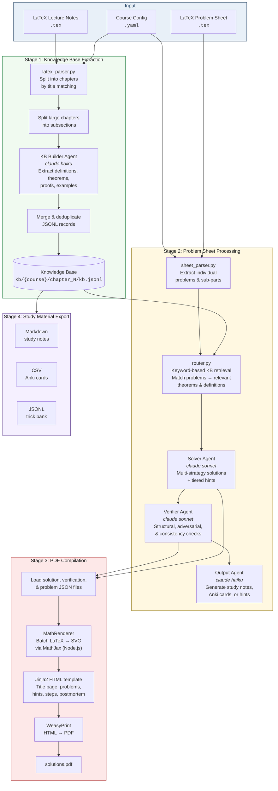

# MathPipe

An autonomous mathematics pipeline built on the [Claude Agent SDK](https://github.com/anthropics/claude-code/tree/main/agent-sdk-python) that converts LaTeX lecture notes and problem sheets into structured knowledge bases, verified solutions, and publication-quality PDF solution books.

Given LaTeX source material (lecture notes + problem sheets), MathPipe:

- Extracts a structured **knowledge base** of definitions, theorems, proofs, and techniques
- **Solves** problem sheets with multiple strategies, tiered hints, and step-by-step breakdowns
- **Verifies** solutions via adversarial multi-layer checking
- Generates **study materials** (notes, Anki cards, trick banks)
- Compiles everything into **publication-quality PDFs** with properly rendered LaTeX math (via MathJax SVG)

## Pipeline Flowchart



## Quick Start

```bash
# 1. Install dependencies
pip install -r requirements.txt
npm install  # For MathJax math rendering

# 2. Build knowledge base from lecture notes
python mathpipe.py kb \
  --config config/linear_algebra_ii.yaml \
  --source notes/linear_algebra_ii.tex

# 3. Solve a problem sheet
python mathpipe.py sheet \
  --config config/linear_algebra_ii.yaml \
  --sheet sample_data/example_sheet.tex

# 4. Compile solutions to PDF
python mathpipe.py pdf solutions/linalg_ii_ht2026/sheet_1

# 5. Generate study materials
python mathpipe.py export \
  --config config/linear_algebra_ii.yaml \
  --format study  # or: anki, tricks
```

## Course Configuration

Each course is defined by a YAML config file in `config/`:

```yaml
course_id: "linalg_ii_ht2026"
course_name: "Linear Algebra II"
source: "notes/linear_algebra_ii.tex"

chapters:
  - id: 1
    title: "Determinants"
    pages: [1, 25]
  - id: 2
    title: "Eigenvalues and Eigenvectors"
    pages: [26, 50]

sheets:
  - id: 1
    source: "sheets/sheet_1.tex"
    chapters: [1, 2]

notation_overrides:
  "\\det": "determinant"
  "\\tr": "trace"
```

## Architecture

| Component | File | Purpose |
|-----------|------|---------|
| **CLI** | `mathpipe.py` | Entry point with `kb`, `sheet`, `export`, `pdf` subcommands |
| **LaTeX Parser** | `latex_parser.py` | Splits `.tex` source into per-chapter text via fuzzy title matching |
| **Sheet Parser** | `sheet_parser.py` | Extracts problems from `.tex` sheets (enumerate, heading, or environment strategies) |
| **KB Router** | `router.py` | Keyword-based retrieval matching problems to relevant KB entries |
| **KB Writer** | `kb_writer.py` | JSONL read/write/validate utilities for the knowledge base |
| **Config Loader** | `config_loader.py` | YAML course configuration loader with validation |
| **Agent Runner** | `agent_session.py` | Lightweight Claude Agent SDK session runner for MathPipe agents |
| **PDF Compiler** | `compile_pdf.py` | Two-pass LaTeX-to-SVG-to-PDF renderer (MathJax + WeasyPrint) |
| **Math Renderer** | `math_to_svg.js` | Node.js batch LaTeX-to-SVG using MathJax |

## Agents

All agents run via `agent_session.run_agent()` with only file tools (Read, Write, Glob, Grep) — no Bash, no MCP servers.

| Agent | Prompt | Default Model | Role |
|-------|--------|---------------|------|
| **KB Builder** | `prompts/kb_builder_prompt.md` | Haiku | Extract mathematical objects (definitions, theorems, proofs, examples) into structured JSONL |
| **Solver** | `prompts/solver_prompt.md` | Sonnet | Produce multi-strategy solutions with tiered hints and step-by-step breakdowns |
| **Verifier** | `prompts/verifier_prompt.md` | Sonnet | Adversarial verification: structural, adversarial, and consistency checks |
| **Output** | `prompts/output_prompt.md` | Haiku | Generate study notes, Anki cards, trick banks, or progressive hints |

## PDF Math Rendering

The PDF compiler uses a two-pass architecture for high-quality math:

1. **Pass 1 (Collect):** `latex_to_html()` extracts all LaTeX math fragments (`$...$`, `$$...$$`, `\[...\]`, `\begin{...}...`) and replaces them with unique placeholders
2. **Batch Render:** All fragments are sent to `math_to_svg.js` (MathJax via Node.js) in a single subprocess call, producing SVG strings
3. **Pass 2 (Substitute):** Placeholders are replaced with inline SVGs in the HTML
4. **PDF:** WeasyPrint converts the SVG-rich HTML to a publication-quality PDF

## Output Directory Structure

```
kb/{course_id}/
  chapter_1/kb.jsonl       # Knowledge base per chapter
  chapter_2/kb.jsonl

solutions/{course_id}/
  sheet_1/
    problem_1.json         # Parsed problem statement
    solution_1.json        # Full solution with strategies, hints, postmortem
    verification_1.json    # Adversarial verification report
    context_1.txt          # KB context used by solver
    output_hints.md        # Generated study materials
    solutions.pdf          # Compiled PDF

exports/{course_id}/
  study_notes.md           # Full-course study notes
  anki_cards.csv           # Spaced-repetition flashcards
  trick_bank.jsonl         # Transferable problem-solving techniques
```

## Project Structure

```
mathpipe/
├── mathpipe.py              # CLI entry point (kb, sheet, export, pdf)
├── compile_pdf.py           # PDF compiler (also standalone CLI)
├── sheet_parser.py          # LaTeX problem sheet parser
├── latex_parser.py          # LaTeX chapter/section splitter
├── router.py                # KB retrieval & routing
├── kb_writer.py             # JSONL KB read/write utilities
├── config_loader.py         # YAML course config loader
├── agent_session.py         # Agent session runner (Claude Agent SDK)
├── math_to_svg.js           # Node.js MathJax LaTeX→SVG renderer
│
├── config/
│   ├── linear_algebra_ii.yaml           # Linear Algebra II course config
│   └── example_functional_analysis.yaml # Functional Analysis example config
│
├── prompts/
│   ├── kb_builder_prompt.md     # KB extraction agent prompt
│   ├── solver_prompt.md         # Problem solver agent prompt
│   ├── verifier_prompt.md       # Adversarial verifier agent prompt
│   └── output_prompt.md         # Study material generator agent prompt
│
├── notes/
│   └── linear_algebra_ii.tex    # Real lecture notes (Linear Algebra II)
│
├── sample_data/
│   ├── example_chapter.tex      # Sample Functional Analysis chapter
│   └── example_sheet.tex        # Sample problem sheet (8 problems)
│
├── requirements.txt             # Python dependencies
├── package.json                 # Node.js dependencies (mathjax-full)
├── .env.example                 # Environment variable template
└── LICENSE                      # MIT
```

## Prerequisites

- Python 3.11+
- Node.js 18+ (for MathJax math rendering in PDFs)
- [Claude Agent SDK](https://github.com/anthropics/claude-code/tree/main/agent-sdk-python)

```bash
# Python dependencies
pip install -r requirements.txt

# Node.js dependencies (for PDF math rendering)
npm install
```

## License

MIT License - see [LICENSE](LICENSE) for details.
