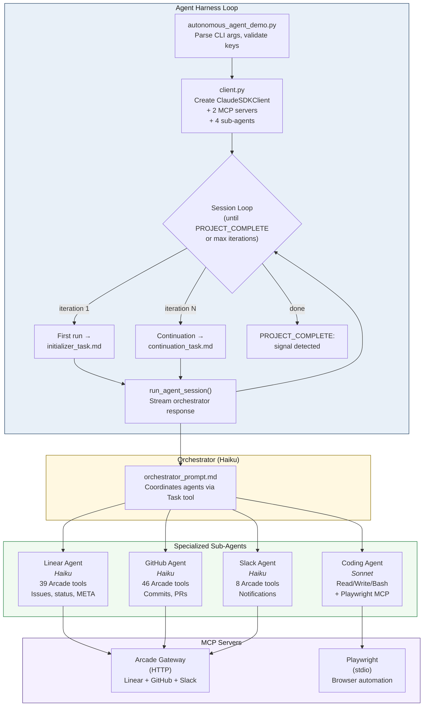

# MathPipe & Claude Engineer

This repository contains two autonomous agent systems built on the [Claude Agent SDK](https://github.com/anthropics/claude-code/tree/main/agent-sdk-python):

1. **MathPipe** — An autonomous mathematics pipeline that converts LaTeX lecture notes and problem sheets into structured knowledge bases, verified solutions, and publication-quality PDF solution books.
2. **Claude Engineer** — A long-running autonomous software engineer that manages projects via Linear, writes code, commits to GitHub, and communicates progress via Slack.

---

## MathPipe

MathPipe is an end-to-end pipeline for university-level mathematics. Given LaTeX source material (lecture notes + problem sheets), it:

- Extracts a structured **knowledge base** of definitions, theorems, proofs, and techniques
- **Solves** problem sheets with multiple strategies, tiered hints, and step-by-step breakdowns
- **Verifies** solutions via adversarial multi-layer checking
- Generates **study materials** (notes, Anki cards, trick banks)
- Compiles everything into **publication-quality PDFs** with properly rendered LaTeX math (via MathJax SVG)

### Pipeline Flowchart


### Quick Start

```bash
# 1. Install dependencies
pip install -r requirements.txt
npm install  # For MathJax math rendering

# 2. Build knowledge base from lecture notes
python mathpipe.py kb \
  --config config/linear_algebra_ii.yaml \
  --source notes/linear_algebra_ii.tex

# 3. Solve a problem sheet
python mathpipe.py sheet \
  --config config/linear_algebra_ii.yaml \
  --sheet sample_data/example_sheet.tex

# 4. Compile solutions to PDF
python mathpipe.py pdf solutions/linalg_ii_ht2026/sheet_1

# 5. Generate study materials
python mathpipe.py export \
  --config config/linear_algebra_ii.yaml \
  --format study  # or: anki, tricks
```

### Course Configuration

Each course is defined by a YAML config file in `config/`:

```yaml
course_id: "linalg_ii_ht2026"
course_name: "Linear Algebra II"
source: "notes/linear_algebra_ii.tex"

chapters:
  - id: 1
    title: "Determinants"
    pages: [1, 25]
  - id: 2
    title: "Eigenvalues and Eigenvectors"
    pages: [26, 50]

sheets:
  - id: 1
    source: "sheets/sheet_1.tex"
    chapters: [1, 2]

notation_overrides:
  "\\det": "determinant"
  "\\tr": "trace"
```

### MathPipe Architecture

| Component | File | Purpose |
|-----------|------|---------|
| **CLI** | `mathpipe.py` | Entry point with `kb`, `sheet`, `export`, `pdf` subcommands |
| **LaTeX Parser** | `latex_parser.py` | Splits `.tex` source into per-chapter text via fuzzy title matching |
| **Sheet Parser** | `sheet_parser.py` | Extracts problems from `.tex` sheets (enumerate, heading, or environment strategies) |
| **KB Router** | `router.py` | Keyword-based retrieval matching problems to relevant KB entries |
| **KB Writer** | `kb_writer.py` | JSONL read/write/validate utilities for the knowledge base |
| **Config Loader** | `config_loader.py` | YAML course configuration loader with validation |
| **Agent Runner** | `agent_session.py` | Lightweight Claude Agent SDK session runner for MathPipe agents |
| **PDF Compiler** | `compile_pdf.py` | Two-pass LaTeX-to-SVG-to-PDF renderer (MathJax + WeasyPrint) |
| **Math Renderer** | `math_to_svg.js` | Node.js batch LaTeX-to-SVG using MathJax |

### MathPipe Agents

All MathPipe agents run via `agent_session.run_agent()` with only file tools (Read, Write, Glob, Grep) — no Bash, no MCP servers.

| Agent | Prompt | Default Model | Role |
|-------|--------|---------------|------|
| **KB Builder** | `prompts/kb_builder_prompt.md` | Haiku | Extract mathematical objects (definitions, theorems, proofs, examples) into structured JSONL |
| **Solver** | `prompts/solver_prompt.md` | Sonnet | Produce multi-strategy solutions with tiered hints and step-by-step breakdowns |
| **Verifier** | `prompts/verifier_prompt.md` | Sonnet | Adversarial verification: structural, adversarial, and consistency checks |
| **Output** | `prompts/output_prompt.md` | Haiku | Generate study notes, Anki cards, trick banks, or progressive hints |

### PDF Math Rendering

The PDF compiler uses a two-pass architecture for high-quality math:

1. **Pass 1 (Collect):** `latex_to_html()` extracts all LaTeX math fragments (`$...$`, `$$...$$`, `\[...\]`, `\begin{...}...`) and replaces them with unique placeholders
2. **Batch Render:** All fragments are sent to `math_to_svg.js` (MathJax via Node.js) in a single subprocess call, producing SVG strings
3. **Pass 2 (Substitute):** Placeholders are replaced with inline SVGs in the HTML
4. **PDF:** WeasyPrint converts the SVG-rich HTML to a publication-quality PDF

### Output Directory Structure

```
kb/{course_id}/
  chapter_1/kb.jsonl       # Knowledge base per chapter
  chapter_2/kb.jsonl

solutions/{course_id}/
  sheet_1/
    problem_1.json         # Parsed problem statement
    solution_1.json        # Full solution with strategies, hints, postmortem
    verification_1.json    # Adversarial verification report
    context_1.txt          # KB context used by solver
    output_hints.md        # Generated study materials
    solutions.pdf          # Compiled PDF

exports/{course_id}/
  study_notes.md           # Full-course study notes
  anki_cards.csv           # Spaced-repetition flashcards
  trick_bank.jsonl         # Transferable problem-solving techniques
```

---

## Claude Engineer

An autonomous software engineer that manages projects, writes code, and communicates progress.

### Engineer Pipeline Flowchart



### Quick Start

```bash
# 1. Install dependencies
pip install -r requirements.txt

# 2. Configure environment
cp .env.example .env
# Edit .env with ARCADE_API_KEY, ARCADE_GATEWAY_SLUG, ARCADE_USER_ID

# 3. Authorize Arcade services (once)
python authorize_arcade.py

# 4. Run the agent
uv run python autonomous_agent_demo.py --project-dir my-app

# Options
uv run python autonomous_agent_demo.py --project-dir my-app --max-iterations 3
uv run python autonomous_agent_demo.py --project-dir my-app --model opus
```

### Key Features

- **Long-running autonomy** via harness architecture with multi-iteration sessions
- **Multi-agent orchestration**: Linear, Coding, GitHub, and Slack agents coordinated by an orchestrator
- **Linear integration**: Automatic issue tracking with real-time status updates
- **GitHub integration**: Commits, branches, and PR creation
- **Slack notifications**: Progress updates delivered to your team
- **Arcade MCP gateway**: Single OAuth flow for all external services
- **Browser testing**: Playwright MCP for automated UI verification
- **Defense-in-depth security**: OS sandbox + filesystem restrictions + bash allowlist + MCP permissions

### Agent Responsibilities

| Agent | Model | Tools | Role |
|-------|-------|-------|------|
| **Orchestrator** | Haiku | Delegates via Task tool | Reads project state, decides what to work on, coordinates sub-agents |
| **Linear** | Haiku | 39 Linear Arcade tools + file tools | Create/update issues, manage META issue, session handoffs |
| **Coding** | Sonnet | File tools + Bash + Playwright | Write code, test via browser, screenshot verification |
| **GitHub** | Haiku | 46 GitHub Arcade tools + Bash | Commits, branches, PRs (requires `GITHUB_REPO`) |
| **Slack** | Haiku | 8 Slack Arcade tools + file tools | Progress notifications (requires `SLACK_CHANNEL`) |

### Customization

- **Change the app to build**: Edit `prompts/app_spec.txt`
- **Adjust issue count**: Edit `prompts/initializer_task.md`
- **Modify allowed commands**: Edit `security.py` `ALLOWED_COMMANDS`

<details>
<summary><strong>Environment Variables Reference</strong></summary>

| Variable | Description | Required |
|----------|-------------|----------|
| `ARCADE_API_KEY` | Arcade API key | Yes |
| `ARCADE_GATEWAY_SLUG` | Arcade MCP gateway slug | Yes |
| `ARCADE_USER_ID` | Your email for user tracking | Recommended |
| `GENERATIONS_BASE_PATH` | Base directory for generated projects (default: `./generations`) | No |
| `GITHUB_REPO` | GitHub repo `owner/repo` for auto-push | No |
| `SLACK_CHANNEL` | Slack channel name (without #) | No |
| `ORCHESTRATOR_MODEL` | Orchestrator model: haiku, sonnet, opus | No |
| `LINEAR_AGENT_MODEL` | Linear agent model | No |
| `CODING_AGENT_MODEL` | Coding agent model | No |
| `GITHUB_AGENT_MODEL` | GitHub agent model | No |
| `SLACK_AGENT_MODEL` | Slack agent model | No |

</details>

---

## Project Structure

```
workflow-bot/
├── mathpipe.py                  # MathPipe CLI entry point
├── compile_pdf.py               # PDF compiler (also standalone CLI)
├── sheet_parser.py              # LaTeX problem sheet parser
├── latex_parser.py              # LaTeX chapter/section splitter
├── router.py                    # KB retrieval & routing
├── kb_writer.py                 # JSONL KB read/write utilities
├── config_loader.py             # YAML course config loader
├── agent_session.py             # MathPipe agent session runner
├── math_to_svg.js               # Node.js MathJax LaTeX→SVG renderer
│
├── autonomous_agent_demo.py     # Claude Engineer CLI entry point
├── agent.py                     # Autonomous agent session loop
├── client.py                    # SDK client factory (MCP + agents)
├── security.py                  # Bash command allowlist & hooks
├── progress.py                  # Linear project state tracker
├── prompts.py                   # Prompt loading utilities
├── arcade_config.py             # Arcade MCP gateway config
├── authorize_arcade.py          # OAuth authorization CLI
├── test_security.py             # Security hook unit tests
│
├── agents/
│   ├── __init__.py              # Agent definitions package
│   └── definitions.py           # Linear, Coding, GitHub, Slack agents
│
├── config/
│   ├── linear_algebra_ii.yaml           # Linear Algebra II course config
│   └── example_functional_analysis.yaml # Functional Analysis example config
│
├── prompts/
│   ├── kb_builder_prompt.md     # MathPipe: KB extraction prompt
│   ├── solver_prompt.md         # MathPipe: problem solver prompt
│   ├── verifier_prompt.md       # MathPipe: adversarial verifier prompt
│   ├── output_prompt.md         # MathPipe: study material generator prompt
│   ├── app_spec.txt             # Claude Engineer: app specification
│   ├── orchestrator_prompt.md   # Claude Engineer: orchestrator system prompt
│   ├── initializer_task.md      # Claude Engineer: first-session task
│   ├── continuation_task.md     # Claude Engineer: continuation task
│   ├── linear_agent_prompt.md   # Claude Engineer: Linear sub-agent prompt
│   ├── coding_agent_prompt.md   # Claude Engineer: Coding sub-agent prompt
│   ├── github_agent_prompt.md   # Claude Engineer: GitHub sub-agent prompt
│   └── slack_agent_prompt.md    # Claude Engineer: Slack sub-agent prompt
│
├── notes/
│   └── linear_algebra_ii.tex    # Real lecture notes (Linear Algebra II)
│
├── sample_data/
│   ├── example_chapter.tex      # Sample Functional Analysis chapter
│   └── example_sheet.tex        # Sample problem sheet (8 problems)
│
├── requirements.txt             # Python dependencies
├── package.json                 # Node.js dependencies (mathjax-full)
├── .env.example                 # Environment variable template
└── LICENSE                      # MIT
```

## Prerequisites

- Python 3.11+
- Node.js 18+ (for MathJax math rendering in PDFs)
- [Claude Code CLI](https://github.com/anthropics/claude-code) (latest)
- [Claude Agent SDK](https://github.com/anthropics/claude-code/tree/main/agent-sdk-python)

```bash
# Python dependencies
pip install -r requirements.txt

# Node.js dependencies (for PDF math rendering)
npm install
```

## License

MIT License - see [LICENSE](LICENSE) for details.
